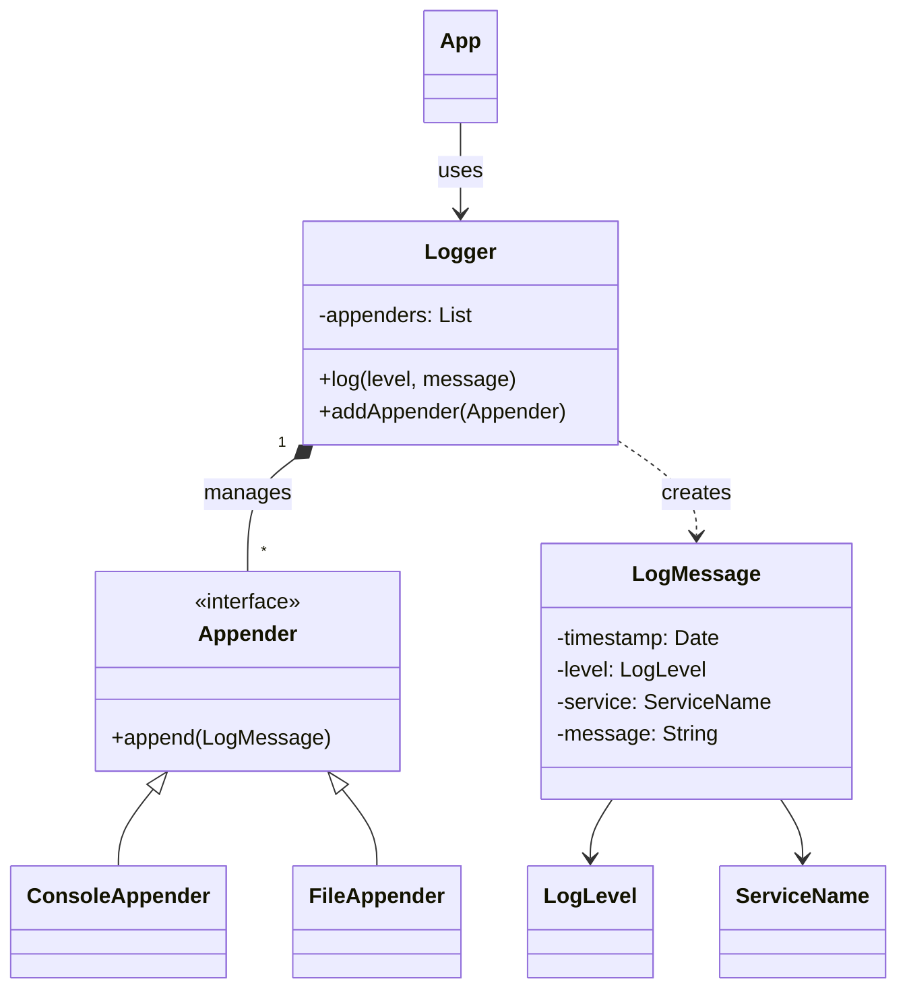
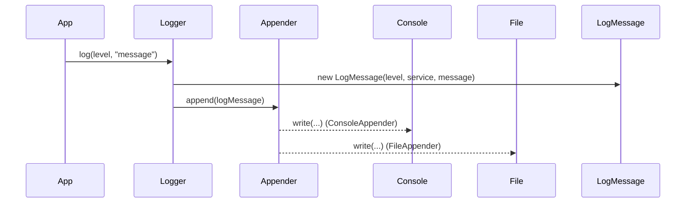

## Getting Started

This repository contains a small, low-level-design (LLD) logging system implemented in Java. It demonstrates a simple Logger with multiple Appenders (Console and File), structured log messages, and enums for log levels and service names.

This README includes an overview, design UML diagrams (Mermaid), and quick compile/run commands for Windows.

**Project layout**

- `src/`: Java source files
- `src/appenders/`: `Appender`, `ConsoleAppender`, `FileAppender`
- `src/enums/`: `LogLevel`, `ServiceName`
- `src/models/`: `LogMessage`
- `bin/`: compiled .class output (created by `javac`)

If you want to customize the folder structure, edit `.vscode/settings.json`.

**Quick run (Windows)**

1. Compile sources into `bin/`:

```powershell
javac -d bin src\*.java src\appenders\*.java src\enums\*.java src\models\*.java
```

2. Run the sample `App`:

```powershell
java -cp bin App
```

Notes:
- The logging output file used by `FileAppender` (if present) is `src/app.log` by default in this workspace.

**Design Overview (LLD)**

The system follows a classic Logger / Appender pattern:

- `App` uses `Logger` to emit logs.
- `Logger` constructs `LogMessage` objects and delegates delivery to one or more `Appender` implementations.
- `Appender` is an interface/abstract base with concrete `ConsoleAppender` and `FileAppender` implementations.
- `LogMessage` holds fields like timestamp, level (`LogLevel`), service (`ServiceName`), and message text.

This separation keeps formatting and transport (appenders) decoupled from logging call sites.

**UML Diagrams (Mermaid)**

Class diagram:



Sequence diagram (typical logging flow):



**Component responsibilities (concise)**

- `App`: example entry point that demonstrates logging calls.
- `Logger`: central API; formats and routes `LogMessage` to all registered `Appender`s.
- `Appender`: responsibility to deliver a `LogMessage` to its destination (console, file, etc.).
- `ConsoleAppender`: writes readable output to stdout.
- `FileAppender`: appends raw/structured log lines to a file (e.g., `src/app.log`).
- `LogMessage`: immutable data holder for a log event.

**Extending the design**

- Add new `Appender` implementations for remote logging (HTTP), rotating files, or structured JSON output.
- Extend `Logger` to support asynchronous dispatch, batching, or filters by `LogLevel`.

**References**

- See the source files in `src/` for implementation details.
- See the source files in `src/` for implementation details.

**PlantUML source**

- The PlantUML source for the diagrams is in `diagrams/architecture.puml` (generated alongside this README). You can render it locally with PlantUML or use an online renderer.

If you'd like, I can also export PNG/SVG diagrams locally (requires PlantUML/Graphviz), or push rendered images into `diagrams/` for you. Which would you prefer next?
